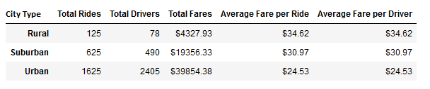

# PyBer_Analysis

### Overview of the analysis:
Thank you V. Isualize for granting Omar and I this PyBer assignment. We will use Pandas and Python to create a summary of the ride-sharing data by city type. The city types listed in this summary are Rural, Urban, and Suburban. Omar and I next use Matplotlib to visualize our results in a colorful line graph depicting the total weekly fares for each city type. 

### Results:

In this chart is the summary of our number crunching data. See the Total Rides, Total Drivers, Total Fares, Average Fare per Ride, and Average Fare per Driver listed. From within the city in the Urban environment PyBer is very popular with the most rides, drivers, and fares. These numbers decrease accordingly with distance from the heart of the big cities. Suburban cities have less than half the total rides and drivers. Rural cities have the least rides and drivers. An inverse relationship is see in the fares accrued however. Urban average fares per ride and per driver are the least, next up are suburban average fares, then rural average fares per ride and per driver are at the peak. Rural rides are more costly than Urban rides. Could distance of rides be the causation of this inverse relationship? 

### Summary:

There is a statement summarizing three business recommendations to the CEO for addressing any disparities among the city types. (4 pt)
V. Isualize may want to balance her PyBer ratio of rides to drivers. There are more rides and drivers in Rural and Suburban cities and many more drivers than rides in Uban cities. It may be financially advantageous to increase the number of rural suburban drivers to pick up those higher averages of fares per ride. The Urban drivers are numerous and paid the least. 
fares by date
fares by week

